<div align="center">


<h1>Alhuda</h1>

<p>Simple Islamic app</p>

[](https://flutter.dev)
[](https://dart.dev)
[](LICENSE)
[](https://flutter.dev)

</div>

---

## 📖 About

&lt;Describe your app in 2–3 sentences. What problem does it solve? Who is it for?&gt;

---

## 📸 Screenshots

<div align="center">

### 🏠 الرئيسية والقرآن الكريم (Home & Holy Quran)

| شاشة البداية <br> Splash Screen | الشاشة الرئيسية <br> Home Screen | المصحف الشريف <br> Holy Quran | فهرس السور <br> Surah Index |
|:---:|:---:|:---:|:---:|
| 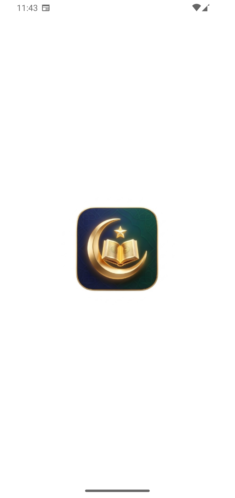 | 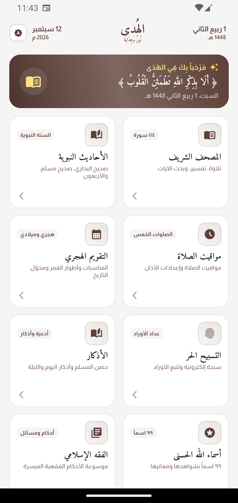 | 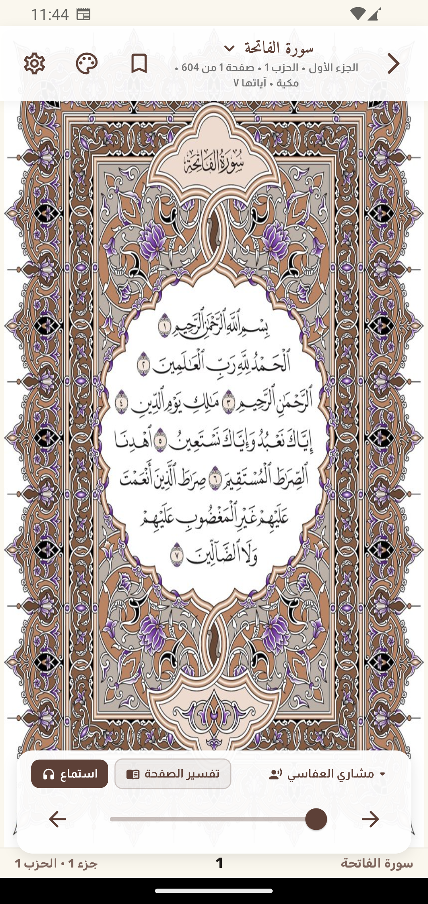 | 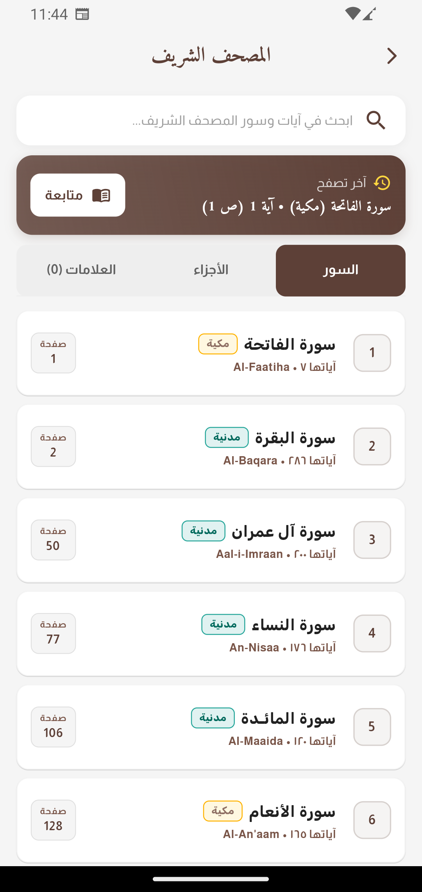 |

### 🕌 الصلاة والقبلة والتقويم (Prayer, Qibla & Calendar)

| مواقيت الصلاة <br> Prayer Times | اتجاه القبلة <br> Qibla Compass | التقويم الهجري <br> Hijri Calendar | التسبيح الحر <br> Electronic Tasbeeh |
|:---:|:---:|:---:|:---:|
| 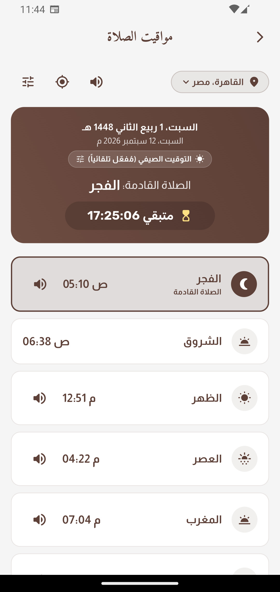 | 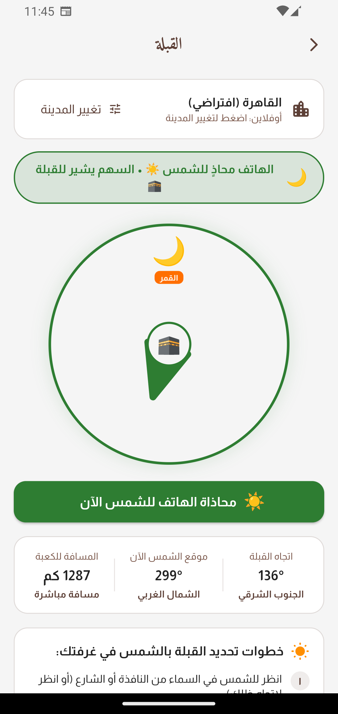 | 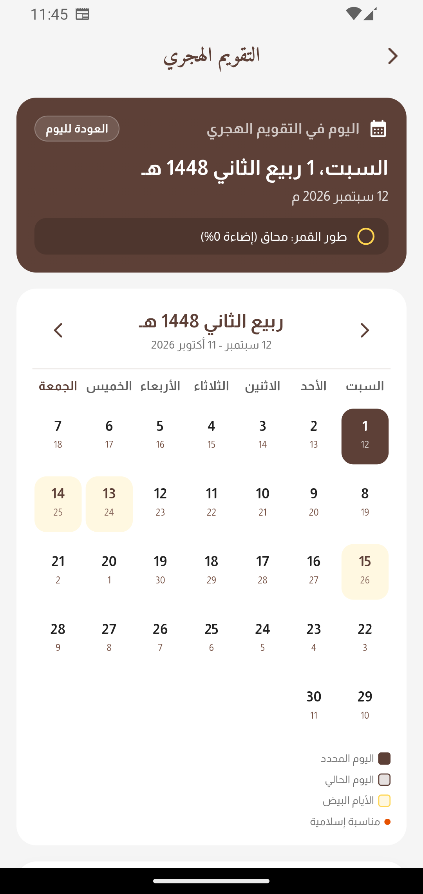 | 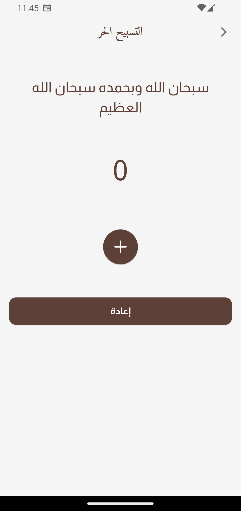 |

### 📚 دواوين الحديث والفقه الإسلامي (Hadith & Islamic Fiqh)

| الأحاديث النبوية <br> Prophetic Hadith | صحيح مسلم <br> Sahih Muslim | موسوعة الفقه <br> Islamic Fiqh | أبواب وفصول الفقه <br> Fiqh Chapters |
|:---:|:---:|:---:|:---:|
| 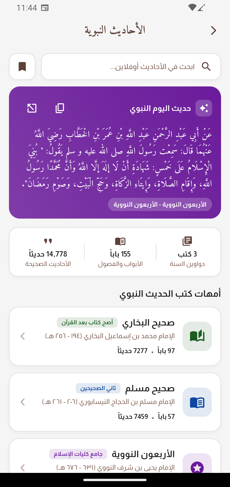 | 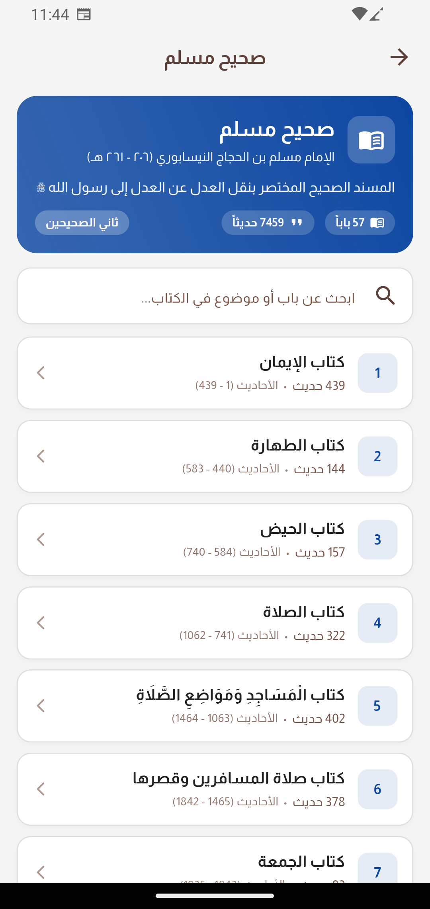 | 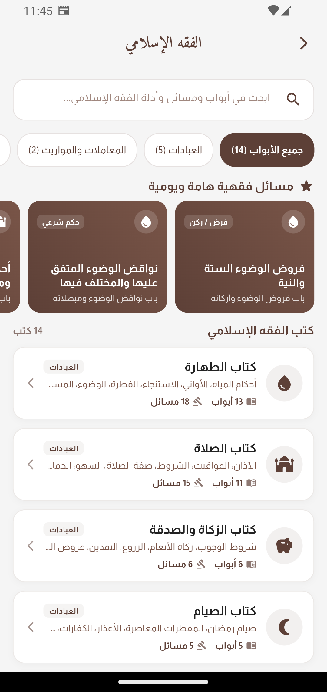 | 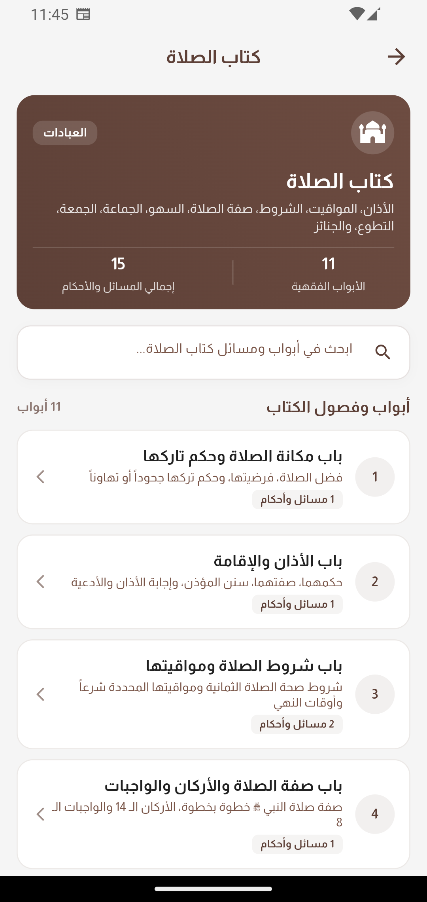 |

### 📿 الأذكار وأسماء الله الحسنى (Azkar & Names of Allah)

| حصن المسلم والأذكار <br> Daily Azkar | عداد الأذكار <br> Azkar Counter | أسماء الله الحسنى <br> Names of Allah | تفاصيل وتدبر الاسم <br> Name Details |
|:---:|:---:|:---:|:---:|
| 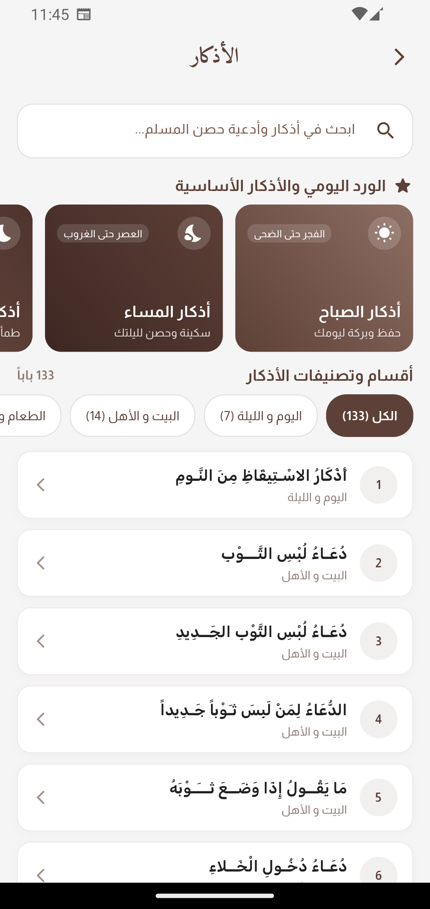 | 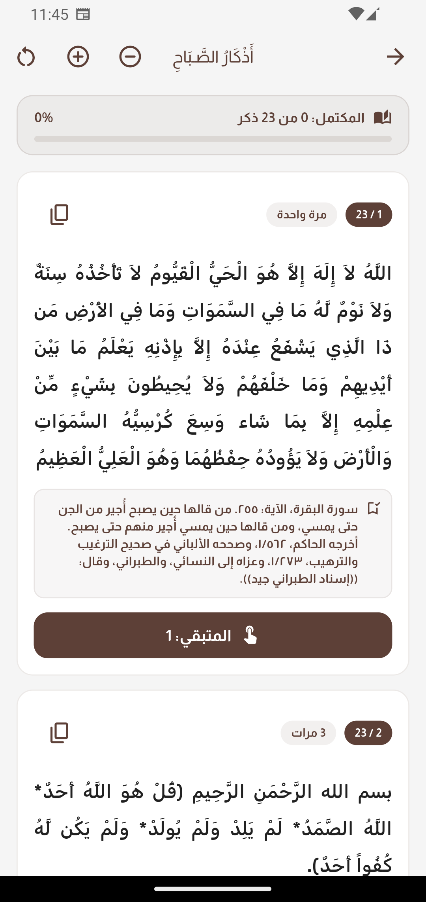 | 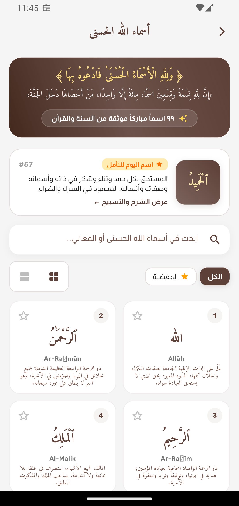 | 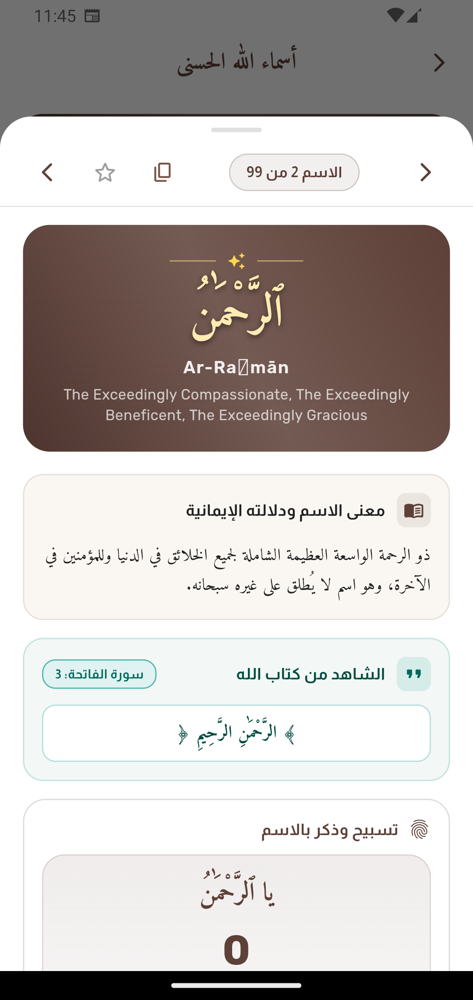 |

</div>

---

## ✨ Features

- ✅ Native splash screen with dark/light support
- ✅ Holy Quran with Tajweed pages, audio recitations (Mishary Alafasy), Ayah tafsir & search (المصحف الشريف وتلاوات وتفسير الآيات)
- ✅ Authentic Prophetic Hadith collections: Sahih Bukhari, Sahih Muslim, and 40 Nawawi (الأحاديث النبوية ودواوين السنة)
- ✅ Accurate prayer times with live countdown to next prayer & offline city search (مواقيت الصلاة)
- ✅ 8 Offline Adhan voices: Sheikh Nasser Al-Qatami (مميز), Makkah (Ali Mullah), Madinah, Mishary Alafasy, Ahmed Basnawi, Essam Khan, Ahmad Khoja, and Dubai Adhan (أصوات الأذان والتنبيهات 100% أوفلاين)
- ✅ Automatic background Adhan playback & notifications at exact prayer times via `android_alarm_manager_plus` & `flutter_local_notifications` (تشغيل الأذان التلقائي في موعد الصلاة)
- ✅ Qibla direction compass with real-time magnetometer/sensors, sun alignment mode & Kaaba geodesic distance (اتجاه القبلة)
- ✅ Hijri calendar with moon phases and Islamic events (التقويم الهجري وأطوار القمر والمناسبات)
- ✅ Electronic Tasbeeh counter with vibration and reset (التسبيح الحر)
- ✅ Daily Azkar & supplications (Hisn Al-Muslim) with interactive counters & progress tracking (الأذكار وحصن المسلم)
- ✅ 99 Names of Allah with meanings, Quranic verses, and Tasbeeh for each name (أسماء الله الحسنى ومعانيها)
- ✅ Simplified Islamic Fiqh encyclopedia with chapters, issues, and evidence (موسوعة الفقه الإسلامي الميسر)
- ✅ Hourly local notifications for Dhikr and remembrance

---

## 🛠️ Tech Stack

| Technology | Purpose |
|-----------|---------|
| Flutter | UI framework |
| Dart | Programming language |
| flutter_native_splash | Building native splash screen |
| buttons_tabbar | Custom tab bar |
| flutter_screenutil | Make screens responsive |
| muslim_data_flutter | Offline prayer times, calculation methods, and geocoding |
| audioplayers | Cross-platform audio playback and streaming for Adhan |
| android_alarm_manager_plus | Exact system-level background alarms for prayer times |
| flutter_local_notifications | Adhan notification sound channel and reminder notifications |
| flutter_qiblah | Real-time Qibla compass & sensor stream |
| qibla | Kaaba geodesic distance and bearing calculations |
| geolocator | Location permissions and coordinates |

---

## 🚀 Getting Started

### Prerequisites

- Flutter SDK `>=3.0.0` — [Install](https://docs.flutter.dev/get-started/install)
- Android Studio or VS Code

### Installation

```bash
# Clone the repo
git clone https://github.com/Ahmed-Moataz-glitch/Alhuda.git

# Install dependencies
flutter pub get

# Run the app
flutter run
```

### Build

```bash
# Android APK
flutter build apk --release

# iOS
flutter build ios --release
```

---

## 🗺️ Roadmap

- [x] &lt;Completed feature&gt;
- [ ] &lt;Planned feature&gt;

See [open issues](https://github.com/Ahmed-Moataz-glitch/Alhuda/issues) for known bugs and requested features.

---

## 🤝 Contributing

1. Fork the repository
2. Create your branch: `git checkout -b feature/YourFeature`
3. Commit your changes: `git commit -m 'Add YourFeature'`
4. Push to the branch: `git push origin feature/YourFeature`
5. Open a Pull Request

---

## 📄 License

Distributed under the MIT License. See [`LICENSE`](LICENSE) for more information.

---

## 📬 Contact

**Ahmed Moataz**

[](https://github.com/Ahmed-Moataz-glitch)
[](https://linkedin.com/in/<your-linkedin>)

---

<div align="center">
  Made with ❤️ by <b>Ahmed Moataz</b> — ⭐ Star this repo if you found it helpful!
</div>
